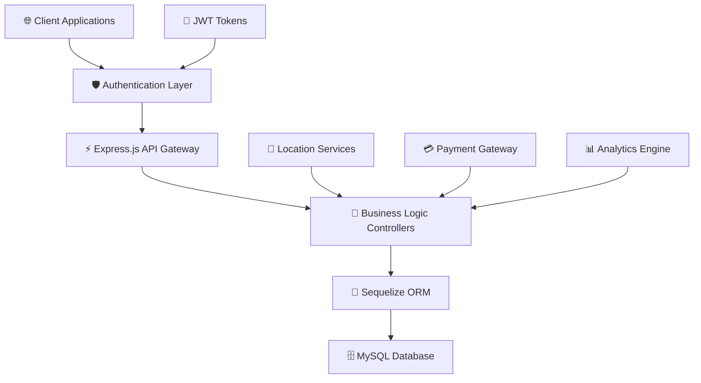
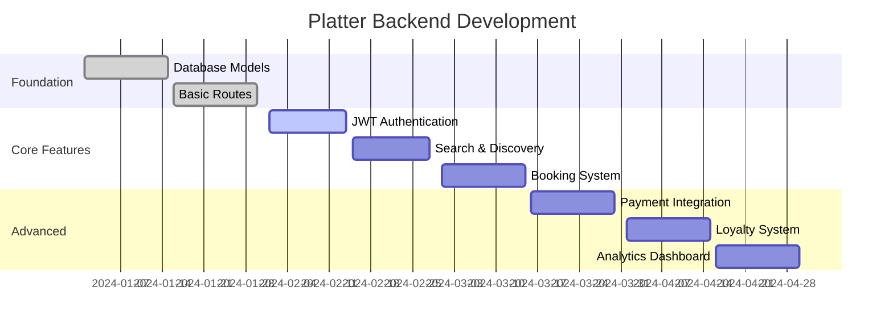

# 🍴 **Platter** - Smart Restaurant Discovery Backend

<div align="center">


**The intelligent restaurant discovery platform that connects food lovers with their perfect dining experience**

[](https://nodejs.org/)
[](https://expressjs.com/)
[](https://mysql.com/)
[](https://jwt.io/)

---

### 🌟 *"Where every meal becomes a memorable experience"*

</div>

## ✨ **What Makes Platter Special?**

<table>
<tr>
<td width="50%">

### 🎯 **For Food Enthusiasts**
- 📍 **Smart Location Discovery** - Find hidden gems nearby
- 🔍 **Intelligent Search** - Discover dishes that match your cravings  
- 🪑 **Seamless Booking** - Reserve your perfect spot
- 💳 **Effortless Payments** - Order and pay in seconds
- ⭐ **Trusted Reviews** - Only from verified diners
- 🎁 **Loyalty Rewards** - Every bite earns points

</td>
<td width="50%">

### 👨‍🍳 **For Restaurant Partners**
- 📊 **Real-time Dashboard** - Live order & table management
- 📈 **Performance Analytics** - Track your bestsellers
- 🏆 **Recognition System** - Earn badges for excellence
- 👥 **Customer Insights** - Understand your diners better
- 💬 **Authentic Feedback** - Verified customer reviews
- 🚀 **Growth Tools** - Boost your restaurant's visibility

</td>
</tr>
</table>

---

## 🏗️ **Architecture & Technology**

<div align="center">



</div>

### 🛠️ **Tech Stack Breakdown**

<table>
<tr>
<td align="center"><br><strong>Runtime Engine</strong></td>
<td align="center"><br><strong>Web Framework</strong></td>
<td align="center"><br><strong>Database</strong></td>
<td align="center"><br><strong>ORM</strong></td>
</tr>
<tr>
<td align="center"><br><strong>Authentication</strong></td>
<td align="center"><br><strong>Security</strong></td>
<td align="center"><br><strong>Cross-Origin</strong></td>
<td align="center"><br><strong>Config</strong></td>
</tr>
</table>

---

## 📂 **Project Structure**

```
🍴 platter-backend/
├── 📋 config/               # Database & environment configuration
├── 🎮 controllers/          # Business logic & route handlers
├── 🛡️ middlewares/          # Authentication & validation layers
├── 📊 models/               # Database models & relationships
├── 🛣️ routes/               # API route definitions
├── 🔧 utils/                # Helper functions & utilities
├── 🌍 .env                  # Environment variables
├── 🚀 app.js                # Application entry point
└── 🖥️ server.js             # Server initialization
```

---

## ⚡ **Quick Start Guide**

### 🔧 **Installation**

```bash
# 📥 Clone the repository
git clone https://github.com/yourusername/platter-backend.git
cd platter-backend

# 📦 Install dependencies
npm install

# ⚙️ Setup environment
cp .env.example .env
# Edit .env with your configurations

# 🚀 Start development server
npm run dev
```

### 🌍 **Environment Configuration**

Create your `.env` file with these essential variables:

```env
# 🌐 Server Configuration
PORT=5000
NODE_ENV=development

# 🗄️ Database Settings
DB_HOST=localhost
DB_USER=root
DB_PASSWORD=yourpassword
DB_NAME=platterdb
DB_DIALECT=mysql

# 🔐 Security
JWT_SECRET=your_super_secure_jwt_secret
JWT_EXPIRES_IN=7d

# 📧 Optional Services
EMAIL_SERVICE=gmail
EMAIL_USER=your-email@gmail.com
EMAIL_PASS=your-app-password
```

---

## 🧪 **Testing & Development**

<div align="center">

### 🔍 **API Testing Tools**

| Tool | Purpose | Status |
|------|---------|--------|
| 📮 **Postman** | API Testing Suite | Coming Soon |
| 📚 **Swagger** | Interactive Documentation | Planned |
| 🧪 **Jest** | Unit Testing | In Development |
| 🔄 **Thunder Client** | VS Code Extension | Supported |

</div>

---

## 📋 **Development Roadmap**

<div align="center">

### 🎯 **Current Sprint**

</div>



### ✅ **Progress Tracker**

- [x] 🏗️ **Foundation Setup** - Project structure & dependencies
- [x] 🗄️ **Database Models** - Sequelize ORM implementation  
- [ ] 🔐 **Authentication** - JWT-based user management
- [ ] 🔍 **Smart Search** - Advanced filtering & location-based discovery
- [ ] 🪑 **Booking Engine** - Table reservation system
- [ ] 💳 **Payment Gateway** - Secure transaction processing
- [ ] 🎁 **Loyalty Program** - Points & reward system
- [ ] 📊 **Admin Dashboard** - Restaurant management portal

---

## 🤝 **Contributing to Platter**

<div align="center">

**We welcome contributions from the community!** 

[](http://makeapullrequest.com)
[](https://github.com/yourusername/platter-backend/issues?q=is%3Aissue+is%3Aopen+label%3A%22good+first+issue%22)

</div>

### 🌟 **How to Contribute**

1. 🍴 **Fork** the repository
2. 🌿 **Create** a feature branch (`git checkout -b feature/amazing-feature`)
3. 💾 **Commit** your changes (`git commit -m 'Add amazing feature'`)
4. 📤 **Push** to the branch (`git push origin feature/amazing-feature`)
5. 🔄 **Open** a Pull Request

### 📝 **Contribution Guidelines**

- Follow our coding standards and conventions
- Write clear, concise commit messages
- Add tests for new features
- Update documentation as needed
- Be respectful and constructive in discussions

---

## 📞 **Connect With Us**

<div align="center">

### 👨‍💻 **Meet the Creator**

**Arjun Sharma** - *Full Stack Developer & Food Enthusiast*

[](mailto:ar29061999@gmail.com)
[](https://linkedin.com/in/arjun2903)
[](https://github.com/spidy29)

---

### 💬 **Let's Connect!**

*Have questions, suggestions, or just want to chat about food and tech?*  
*Feel free to reach out - I'd love to hear from you!* 🍕

</div>

---

<div align="center">

### 🌟 **Star this repo if you found it helpful!**

[](https://github.com/Spidy29/platter-backend/stargazers)
[](https://github.com/Spidy29/platter-backend/network)

---

*Made by Arjun Sharma*

**© 2025 Platter. All rights reserved.**

</div>
